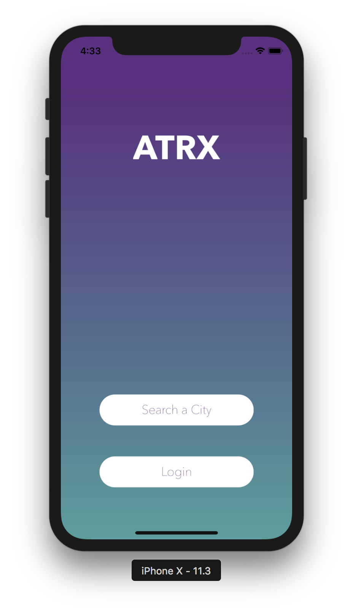
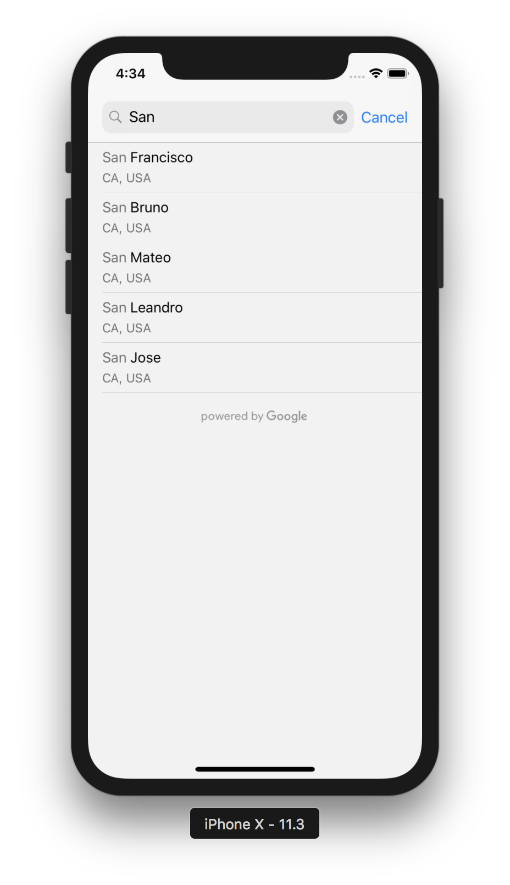
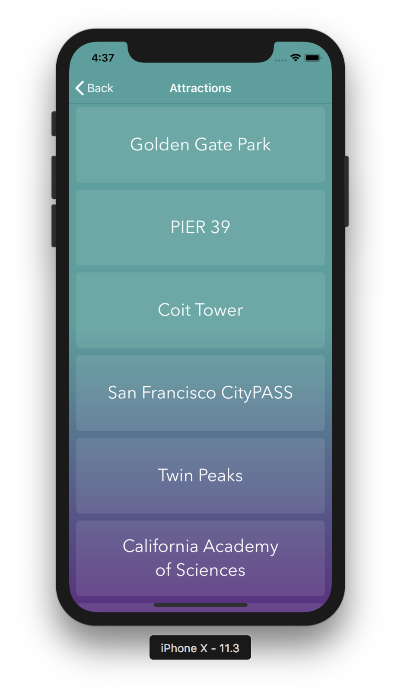
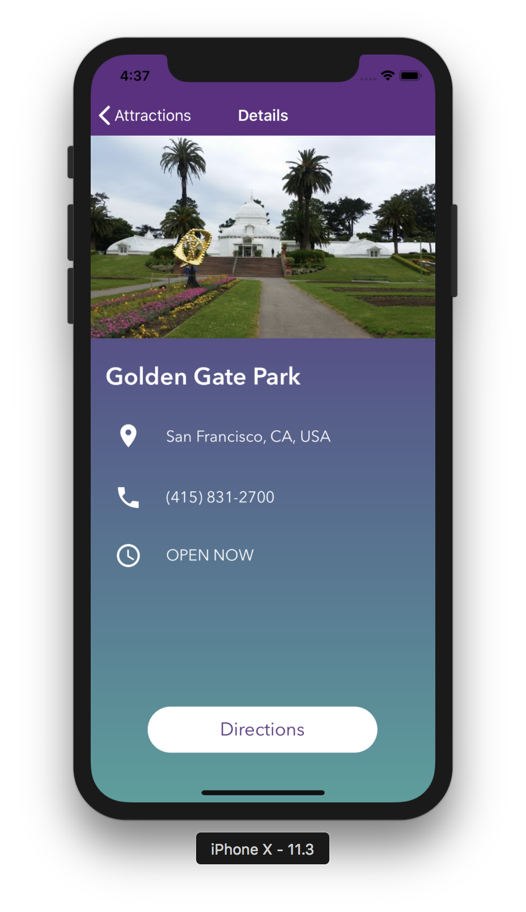
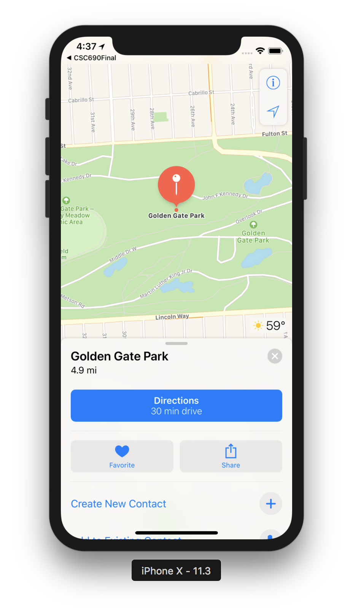

# CSC690-Atrx

## Description
ATRX is an IOS app where a user can search for a city and see the top tourist attractions for that city. A user can click on an attraction to see more details such as a picture, phone number and address.

This app was created by three students for the CSC 690  class at SFSU

## Team

### Sukhjit Singh <a href="https://github.com/sukhjitsingh"></a>

### Loraine Goveas <a href="https://github.com/LorraineGoveas"></a>

### Abigail Chin <a href="https://github.com/michinchin"></a>

## Demo 


## Screenshots

<div style={{display: flex; flex-direction: row}}>
  
  
  
</div>
<div style={{display: flex; flex-direction: row}}>
  
  
  <!--  -->
</div>


## Features
##### Must have:
- Login and profile (10 hours)
- Search by city or attraction(20 hours)
- Attraction report (20 hours)

##### Nice to have:
- Upvote and downvote system (10 hours)
- Recommendation of top cities
- Comments

## Work-load
Sukhjit: 
- attraction report (20 hours)

Lorraine: 
- backend (20 hours)

Abigail:
- login/profile, search by city (20 hours)

#### APIs
- Google Places
- Google Maps POI
- Apple Maps
- Firebase

## Getting Started 

```
git clone https://github.com/sukhjitsingh/CSC690-Atrx.git

open in Xcode
```

