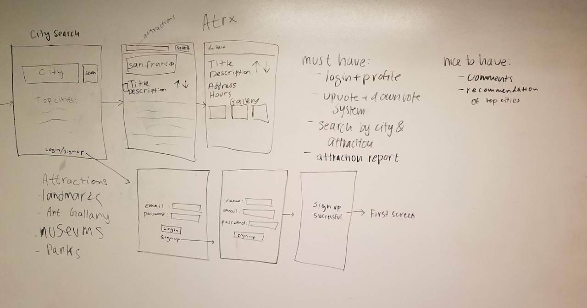

# CSC690-Atrx
iOS app for attractions to see in a city.


## Team

### Sukhjit Singh
<a href="https://github.com/sukhjitsingh"></a>

### Loraine Goveas
<a href="https://github.com/LorraineGoveas"></a>

### Abigail Chin
<a href="https://github.com/michinchin"></a>

## Wireframes




## Features / work-load
Login and profile (10 hours)
Search by city and attraction(20 hours)
Attraction report (20 hours)
Upvote and downvote system (10 hours)


Sukhjit: attraction report (20 hours)

Lorraine: search by attraction and upvote/downvote system (20 hours)

Abigail: login/profile, search by city (20 hours)


## Getting Started 

```
git clone https://github.com/sukhjitsingh/CSC690-Atrx.git

open in Xcode
```

